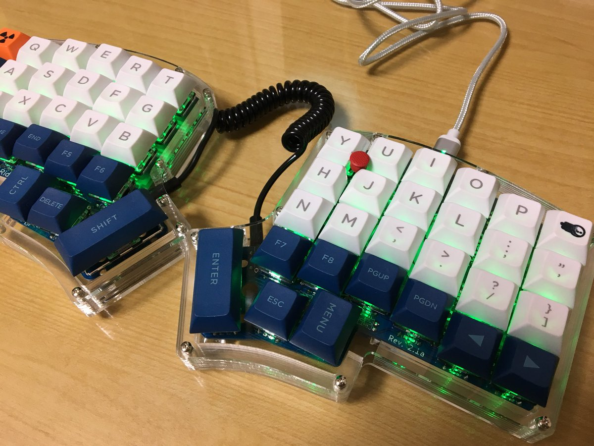
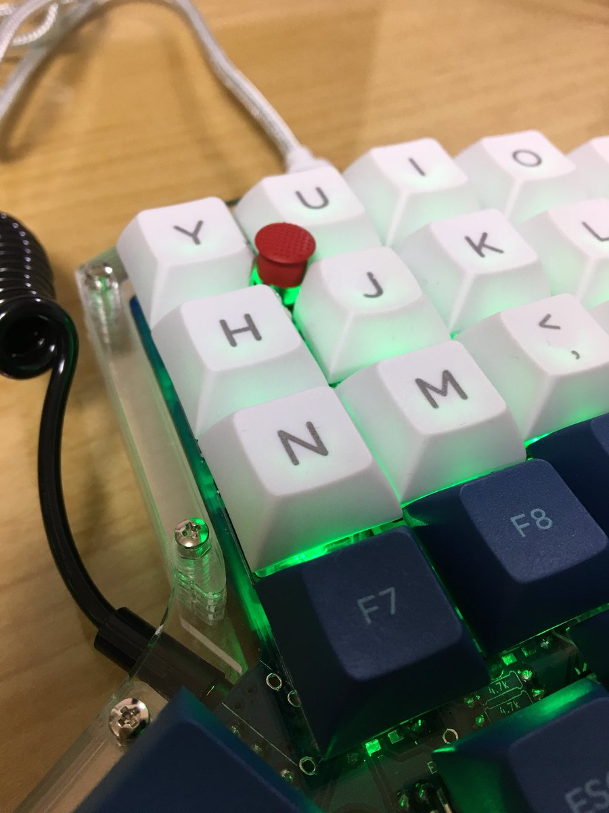
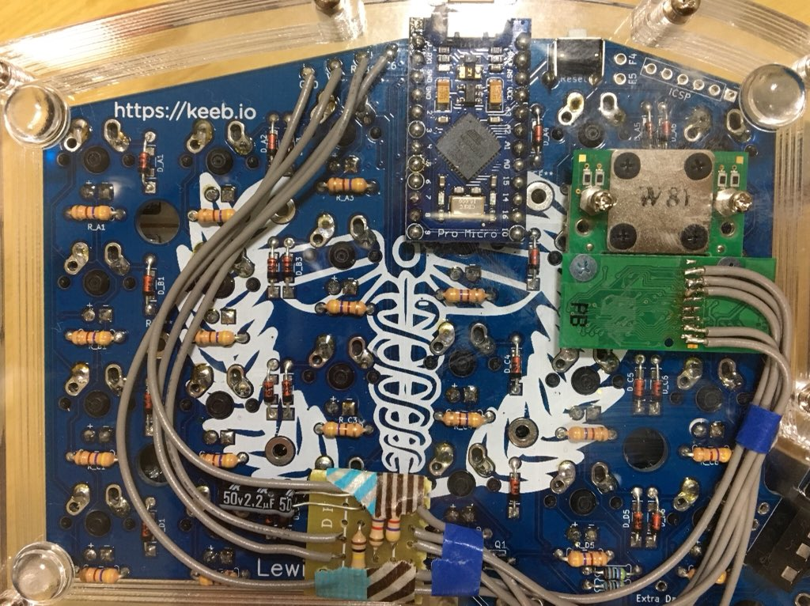
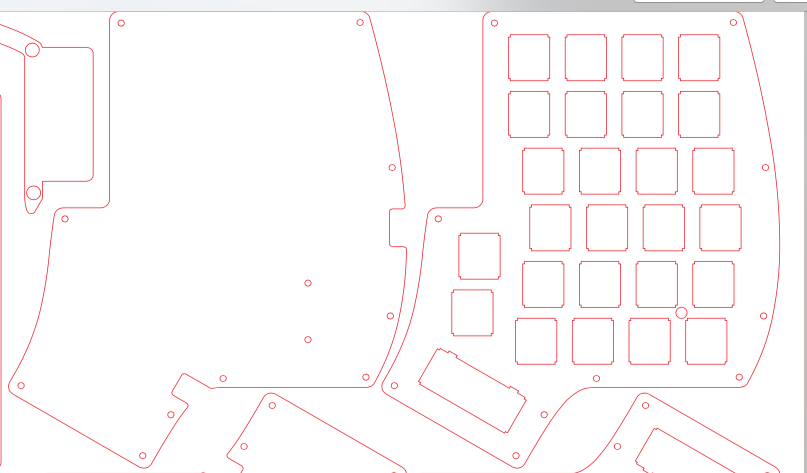

How to implement a trackpoint to Iris keyboard
===

Overview
---

This is a brief guide to implement a trackpoin to [Iris keyboard](https://keeb.io/products/iris-keyboard-split-ergonomic-keyboard).

Assembling
---

I implement a trackpoint following [alonswartz/trackpoint](https://github.com/alonswartz/trackpoint).
However, in alonswartz's guide, it uses USART version of [QMK's PS/2 mouse support](https://github.com/rinx/qmk_firmware_iris_rinx/blob/ebce5953fe4f1176706b5f53b95dd17ad0dfe4be/rules.mk#L19-L20).  
USART version cannot be used for Iris keyboard because D5 pin on pro micro cannot be used.
In this guide, interrupt version that requires INT or PCINT pin for clock and any pin for data is used.

Fortunately, Iris has breakout pins (RGB1, C6, VCC, GND, F4, F5, and ICSP pins) on its PCB.
Here, I use RGB1 (D3) pin for clock and C6 pin for data.

You can identify your trackpoint pinouts from the list on [https://geekhack.org/index.php?topic=55960.msg1291412#msg1291412](https://geekhack.org/index.php?topic=55960.msg1291412#msg1291412).
I extracted a trackpoint module from X61 keyboard. It is same with R61's.

It is useful to use PCB hole (maybe it is a hole for spacers) for trackpoint stem.
On the other hand, you have to make a stem hole in case.
I cut acrylic plates like following.

It has two holes on the bottom plate to fix the trackpoint module.

Code
---

Here's my codes for Trackpoint Iris.

In the `rules.mk`, you have to [disable `RGBLIGHT_ENABLE`](https://github.com/rinx/qmk_firmware_iris_rinx/blob/ebce5953fe4f1176706b5f53b95dd17ad0dfe4be/rules.mk#L15) because we use RGB1 (D3) pin for PS/2 clock.
And you have to [enable PS2 Mouse support](https://github.com/rinx/qmk_firmware_iris_rinx/blob/ebce5953fe4f1176706b5f53b95dd17ad0dfe4be/rules.mk#L19-L20) like this.

In [config.h](https://github.com/rinx/qmk_firmware_iris_rinx/blob/ebce5953fe4f1176706b5f53b95dd17ad0dfe4be/config.h#L70-L91), you have to set which pins are used for PS/2 mouse support.

References
---

- [Iris keyboard](https://keeb.io/products/iris-keyboard-split-ergonomic-keyboard)
- [alonswartz/trackpoint](https://github.com/alonswartz/trackpoint)
- [QMK firmware's PS/2 Mouse Support](https://docs.qmk.fm/feature_ps2_mouse.html)
- [https://geekhack.org/index.php?topic=55960.msg1291412#msg1291412](https://geekhack.org/index.php?topic=55960.msg1291412#msg1291412)

